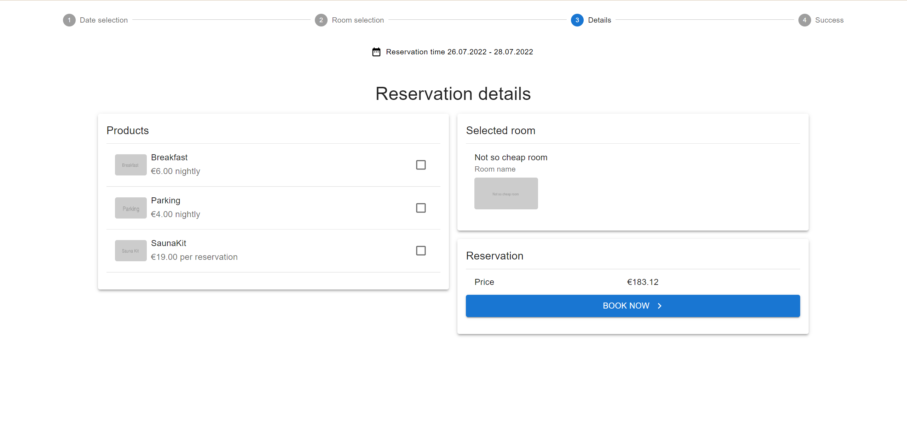

# Rooms booking

## Installation and launch
### For the client side:
1. `cd rooms-booking-client`
2. `npm install`
2. `npm start`

### For the server side:
1. `cd rooms-booking-server`
2. `npm install`
3. `npm start`

Then view in the browser http://localhost:3000/

### Screen example:
